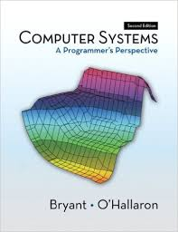

= COS 284&mdash;Introduction to Computer Systems

== Introduction

With your host, Dr. Tom Nurkkala

== A Section

In a *bitter* twist of fate,
the previous edition (the 2^nd^) of our text,
illustrated here:

[.visual]
Has been *replaced*
by a new edition (obviously, the 3^rd^),
which has a fancier cover:

== The Textbook Section

[.visual]
--
Here are some interesting factoids about the course

. It's fun
. You will have a great time
. There will be a ton of work to do
--

[.visual]

image::course/cos284/images/csapp3e-cover.jpg[CSAPP 3 Cover,200]

Here's some math:

latexmath:[C = \alpha + \beta Y^{\gamma} + \epsilon]

asciimath:[sqrt(9) = 3]

NOTE: This is really cool.

[.visual,dest="foo.txt"]
Fred lives in Peru with his estranged wife, Zelda.

//.A Gist from Github
//gist::35f6b8b6d1456ee10a21[]

How quickly does this preview update?

It's really quite a delightful text.
- You should all read it carefully.

Here's a little code for your consumption.

.Some Other Exported Stuff
Some Greek Letters

. Alpha
. Beta
. Gamma

.Title for a Little Code
[[this-is-me]]
[source,javascript,role="visual"]
----
gulp.task('markdown', function() {
    return gulp.src(course)
        .pipe(markdown())
        .pipe(gulp.dest('build'))
});
----
